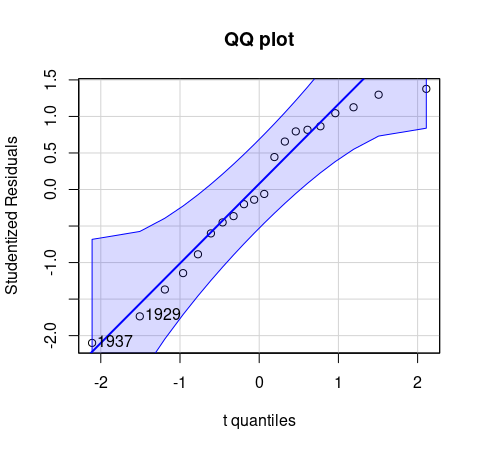

<!-- README.md is generated from README.Rmd. Please edit that file and run rmarkdown::render("README.Rmd") -->

```{r, include = FALSE}
knitr::opts_chunk$set(
  fig.path = "man/figures/README-"
)
```

## Two-Stage Least-Squares Regression with Diagnostics

An implementation of instrumental variables regression using two-stage least-squares
(2SLS) estimation, based on the `ivreg()` function previously in the
[AER](https://CRAN.R-project.org/package=AER) package. In addition to standard regression
functionality (parameter estimation, inference, predictions, etc.) the package provides
various regression diagnostics, including hat values, deletion diagnostics such as
studentized residuals and Cook's distances; graphical diagnostics such as
component-plus-residual plots and added-variable plots; and effect plots with partial
residuals.

**Instrumental variables regression:**

```
library("ivreg")
ivreg(Q ~ P + D | D + F + A, data = Kmenta)
```

**Via two-stage least squares (2SLS):**

```{r 2sls, echo=FALSE, results="hide"}
exams::tex2image("\\begin{eqnarray*}
  y                                  & = & X \\beta + \\varepsilon \\\\
  \\widehat{X}                       & = & Z (Z^\\top Z)^{-1} Z^\\top X \\\\
  \\widehat{\\beta}_{\\mathrm{2SLS}} & = & (\\widehat{X}^\\top \\widehat{X}) \\widehat{X}^\\top y
\\end{eqnarray*}",
  format = "svg", pt = 17, width.border = 5, col.border = "red",
  dir = file.path(getwd(), "man", "figures"), name = "README-2sls")
```


**With diagnostics:**

```{r effects, echo=FALSE, results="hide", message=FALSE, fig.height=4.7, fig.width=5, fig.show="hide"}
library("ivreg")
library("effects")
library("car")
deq <- ivreg(Q ~ P + D | D + F + A, data = Kmenta)
plot(predictorEffect("P", deq, residuals = TRUE), partial.residuals = list(span = 1))
```

```{r qqplot, echo=FALSE, results="hide", message=FALSE, fig.height=4.7, fig.width=5, fig.show="hide"}
qqPlot(deq, main = "QQ plot")
```

```{r influenceplot, echo=FALSE, results="hide", message=FALSE, fig.height=4.7, fig.width=5, fig.show="hide"}
influencePlot(deq, main = "Influence plot")
```




