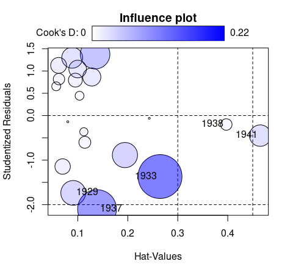

<!-- README.md is generated from README.Rmd. Please edit that file and run rmarkdown::render("README.Rmd") -->

## Two-Stage Least-Squares Regression with Diagnostics

An implementation of instrumental variables regression using two-stage
least-squares (2SLS) estimation, based on the `ivreg()` function
previously in the [AER](https://CRAN.R-project.org/package=AER) package.
In addition to standard regression functionality (parameter estimation,
inference, predictions, etc.) the package provides various regression
diagnostics, including hat values, deletion diagnostics such as
studentized residuals and Cook’s distances; graphical diagnostics such
as component-plus-residual plots and added-variable plots; and effect
plots with partial residuals.

**Instrumental variables regression:**

    library("ivreg")
    ivreg(Q ~ P + D | D + F + A, data = Kmenta)

**Via two-stage least squares (2SLS):**

**With diagnostics:**

